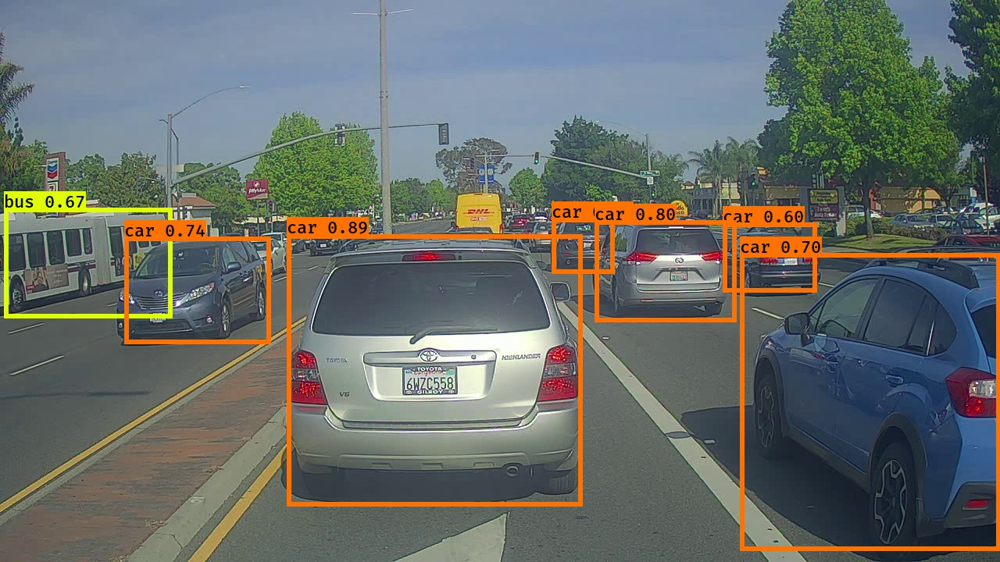

# YOLO OBJECT DETECTION

Implementation is heavily inspired by the YAD2K YOLO. (YAD2K is a 90% Keras/10% Tensorflow implementation of YOLO_v2.)

Original paper: [YOLO9000: Better, Faster, Stronger](https://arxiv.org/abs/1612.08242) by Joseph Redmond and Ali Farhadi.



--------------------------------------------------------------------------------

## Requirements

- [Tensorflow](https://www.tensorflow.org/)
- [Numpy](http://www.numpy.org/)
- [h5py](http://www.h5py.org/) (For Keras model serialization.)
- [Pillow](https://pillow.readthedocs.io/) (For rendering test results.)

## Quick Start

- Download Darknet model cfg and weights from the [official YOLO website](http://pjreddie.com/darknet/yolov2/).
- Convert the Darknet YOLO_v2 model to a Keras model.
- Test the converted model on the small test set in `images/`.
- Run the code in project directory.

```bash
wget http://pjreddie.com/media/files/yolo.weights
wget https://raw.githubusercontent.com/pjreddie/darknet/master/cfg/yolov2.cfg
source activate tf_env  # Activate your TensorFlow environment if you have one
python convert_weights.py --configs=yolo.cfg --weights=yolo.weights --outputs=model_data/yolo.h5
python test_yolo.py  # output in images/out/
```

See `test_yolo.py --help` and `convert_weights.py --help` for more options.

--------------------------------------------------------------------------------

## TODOs

- YOLO_v2 model does not support fully convolutional mode. Current implementation assumes 1:1 aspect ratio images.

--------------------------------------------------------------------------------
